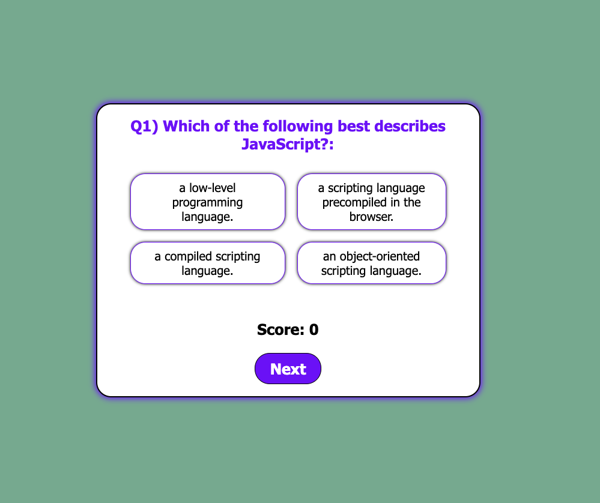

# JavaScript Code Quiz

## Description
As a developer, I want to be able to take a quiz so that I can refresh my knowledge in JavaScript

## Table of Contents
- [Technologies](#Technologies)
- [Installation](#Installation)
- [Usage](#usage)
- [Contributions](#Contributions)
- [Contact](#Contact)

## Technologies
HTML, JavaScript, CSS

## Installation
Clone Repo by running the command line prompt:
`git clone https://github.com/Robert-Schwartz/codeQuiz.git`

## Usage
- Visit the deployed website at https://robert-schwartz.github.io/codeQuiz/ to take the quiz
- Select your answer for each question
- View the results at the end of the quiz

## Contributions
Developed by Robert Schwartz, 2021

## Contact
Contact me with any questions
- Github Profile: (https://github.com/Robert-Schwartz)
- E-mail me: bschwartz23@gmail.com